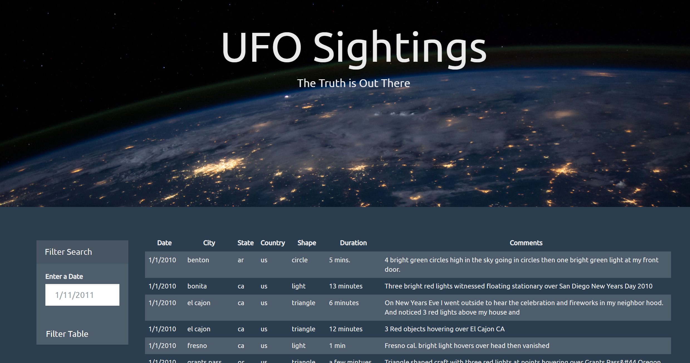
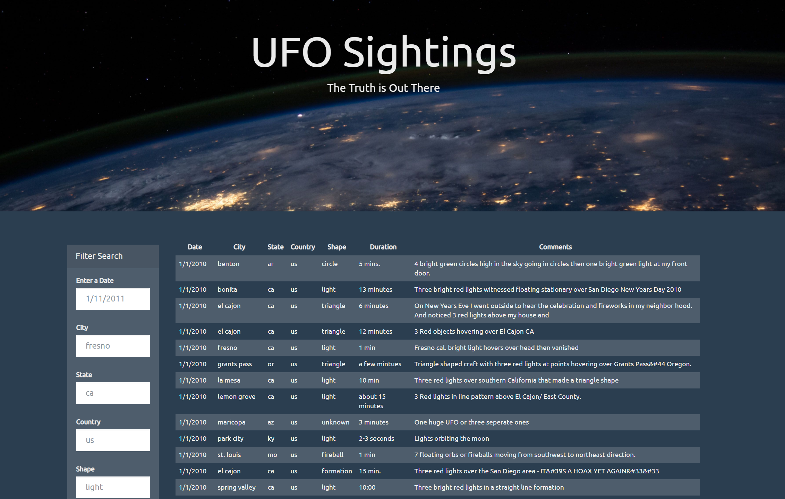

# javascript-challenge

Designed a webpage for UFO sightings using JavaScript, HTML and CSS and D3.js.

This challenge consists of being able to properly sort, filter and display a database based on certain criterias that the user can narrow down upon. The idea is to facilitate looking over certain data by being able to be more specific about the specific datapoints needed.

# UFO LEVEL 1 - SEARCHING BY DATE

# UFO LEVEL 2 - ADVANCED SEARCH

